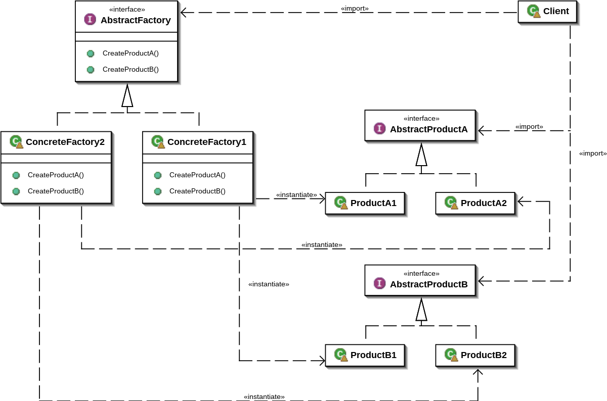

# Abstract Factory Pattern

**_Abstract Factory is a implementation of factory with the facility of group different objects that are well suited together._**

## Description
Let's think on situations where we need certain objects to be created together since the are meant to be part of the same structure. With the use of Factory containing two factory methods we achieve the porpoise of creating an object in this isolated step and giving two or more objects that are related.

## Factory
As previously mentioned this factory is a little bit more complex because is going to have at least two factory methods that each of them will create an instance of his own product. Like products in a restaurant combo (factory for burger and factory for fries) and so on, so the goal here is that each factory is going to be responsible for the creation of his particular product due to the concrete logic inside.
This Factories are known as **Concrete Factories**. Every factory will have the conditions to create the needed objects.

### Product
So continuing with the logic of having at least two products we are going to derive from two abstract products to create our concrete products, following the example of burgers.. We might have, bacon burger, cheese burger and so on, and for fries french fries, curly fries and so on.. so given the context it's where one of each product will be served.
Each concrete product will be created based on an Abstract product that gives the guidelines of each Concrete Product.

### Creator
The **creator** is in charge of implement the needed factory, basically is a class that may contain certain logic for the creation of the product or even if the logic is outside of this class can be passed to decide which product to create also known as Client or even can be a function since in python often is a good idea think more in functions than in classes.

## Summarizing
Abstract Factory solves the problem of object creation within a variety of products that are intended to be together. Therefore we can abstract the creation of products into one place thinking in just the case where the products should be created. Also it's good to think this approach if the list of products can be increased in time.

