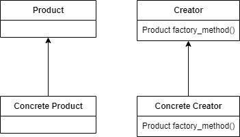

# Factory Method Pattern

**_Factory Method is a creational design pattern that provides an interface for creating objects in a superclass, but allows subclasses to alter the type of objects that will be created._**

## Description
This is a pattern well suited for occasions where you need to create an object in some place that you don´t have the notion of what object should be created in that particular moment (because of certain business logic that may vary). And those objects have a particular base class known as interface that will provide the structure for those particular objects that we want to create, also we have another class that will serve as a creator that will be responsible for the proper construction of that object.

### Product
The **product** is the class that will be the base for our **concrete products** such as Animal as our product and Dog, Cat and Rabbit as concrete products for example.
The abstraction of product help us on passing different parameter to the implementation of this class and giving as result different objects with certain characteristics defining particular objects.

### Creator
The **creator** is in charge of implement the factory method, basically is a class that may contain certain logic for the creation of the product or even if the logic is outside of this class can be passed to decide which product to create.

## Summarizing
Factory method offers a solution to situations where the instances that we need depends on logic for it's creations, like when you have different possible products due to a different scenarios. 
The creations is encapsulated in function or method that will be responsible for logic of creating the object. So this lead us in to only use this _"creator"_ and pass whatever it needs to take the decision of the object that we need.

