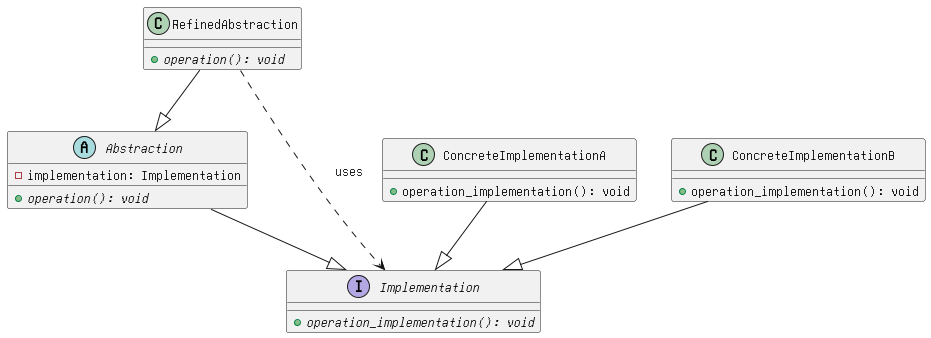

# Bridge Pattern

**_Decouple an abstraction from it's implementation, prioritizing that both of them can be changed independently._**

## Description
The bridge pattern, also known as the bridge design pattern, is a structural design pattern. Structural design patterns deal with how classes and objects can be put together to form larger structures. The main goal of the bridge pattern is to separate abstraction and implementation so that they can be developed and modified independently of each other.

> Changes the inheritances to composition to deocuple the depandant classes




### Abstraction
Abstraction (also called interface) is a high-level control layer for some entity. This is the element or interface with which the **client interacts**.

This work delegation is made by mantining a reference to an object of type **Implementation** (or implementor).

In code is reflected in an abstract class (ABC for example in python) that will have a constructor to the **Implmentation** class.

> Abstraction is the interface with which the client interacts, this is where the bussiness logic resides

### Implementation or Implementors
Also called the ==Bridge==. Declares the interface that is common to for all concrete implementations. So the abtraction can only communicate with an implementation object with methods defined here.

The methods declared here typically are only primitive operations for the specific variants needed (specific objects), while the abstraction defines higer-level operations on those primitives.

_Abstractions use the implementations methods to perform it's operations_

```
Abstraction (Shape)
    ↓ has-a (composition)
Implementation Interface (Renderer)
```

### Refined Abstraction
They are classes that inherits from from the **Abstraction** class. Extends the interface defined by the abstraction (may add more methods to those declared in the abstraction).
They perform complex operations by using the primitives in the implementation.

### Concrete Implementation
Contains the specifics on how the different implementations are going to behave. So implements the methods to it's own scenario for that specific object.

> Abstraction delegates to Implementation rather than inheriting from it.


## When to Use the Bridge Pattern
### During Design Phase
- **Multiple Orthogonal Dimensions:** When your domain naturally has two or more independent dimensions of variation. Ask yourself: "Could I want to combine any X with any Y?" If yes, and X and Y are different concepts, consider Bridge.
Examples:

    - Shapes × Rendering methods
    - Message types × Sending mechanisms (Email, SMS, Push)
    - Data formats × Storage backends
    - GUI components × Platforms (Windows, Mac, Linux)

- **Platform Independence:** When you're building something that needs to work across multiple platforms or environments, and you want to keep platform-specific code isolated.

- **Evolving Requirements:** When you anticipate that either the abstraction or implementation will need to evolve independently. If adding new abstractions shouldn't require touching implementation code (or vice versa), Bridge provides that isolation.

### During Refactoring
- **Inheritance Explosion:** The clearest signal. If you notice your class count growing multiplicatively with each new variation, you have orthogonal concerns mixed in one hierarchy.

- **Duplicate Code Across Variants:** If you find yourself copying code between VectorCircle and RasterCircle because the "circle" logic is the same, that's a sign the circle concept should be extracted.

- **Difficulty Adding New Variants:** If adding a new rendering method means creating N new classes (one per shape), or adding a new shape means creating M new classes (one per renderer), Bridge will help.

- **Tight Coupling to Platforms:** If your business logic is littered with platform-specific conditionals or imports, Bridge can separate concerns.

## Summarizing
This pattern applies for whenever you have cases with multiple variation of single component. Like a remote control that needs to work with different devices. So instead of create a subclass for each variant, we can separate the common functionality from the** platform-specific code**. 
This comes by the cost of increased complexity, since we are handling multiple implementations. Changes has to be performed on multiple sides.