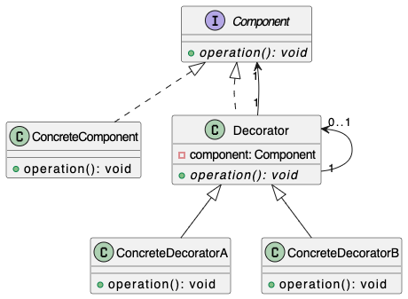

# Decorator Pattern

**_The Decorator Pattern attaches aditional responsabilities dynamically, provides a flexible alternative to extend some classes functionality. This is made at run time._**

## Description
Allows behavior to be added to individual objects dynamically, without affecting the behavior of other objects from the same class. It is used to extend or modify the behavior of objects at runtime by wrapping them in an object of a decorator class. This pattern promotes the principle of Open/Closed Principle, which states that classes should be open for extension but closed for modification.

### Component
Common interface for the wrappers and wrapped object. Base logic for each object, the intended functionality here is soposed to be changed with the wrappers.

### Concrete Component
Class that is going to be wrapped, defines the base behavior wich can be altered by the wrappers.

### Base Decorator
References a wrapped object (component object). Defines an interface that can contain both concret component and decorators. The base decorator delegates all operations to the wrapped object.

### Concrete Decorator
Defines de extra behavior that can be added to components dynamically. Concrete decorators override methods of the base decorator and execute their behavior either before or after calling the parent method.
