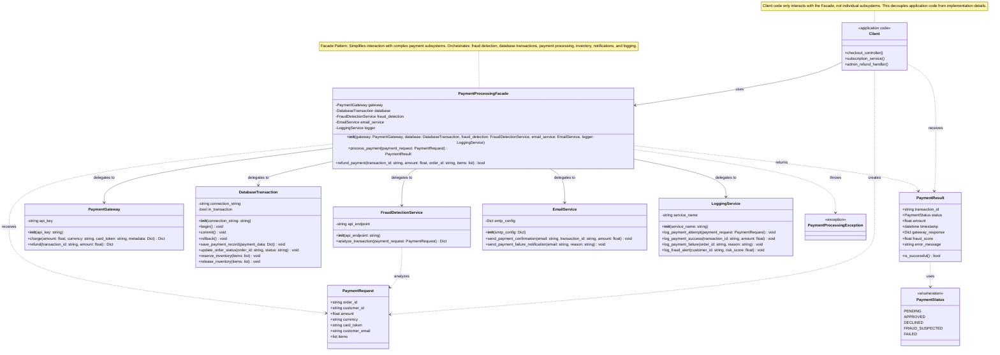

```mermaid blocks

classDiagram
    %% Data Models
    class PaymentStatus {
        <<enumeration>>
        PENDING
        APPROVED
        DECLINED
        FRAUD_SUSPECTED
        FAILED
    }
    
    class PaymentRequest {
        +string order_id
        +string customer_id
        +float amount
        +string currency
        +string card_token
        +string customer_email
        +list items
    }
    
    class PaymentResult {
        +string transaction_id
        +PaymentStatus status
        +float amount
        +datetime timestamp
        +Dict gateway_response
        +float fraud_score
        +string error_message
        +is_successful() bool
    }
    
    %% Subsystem Classes
    class PaymentGateway {
        -string api_key
        +__init__(api_key: string)
        +charge(amount: float, currency: string, card_token: string, metadata: Dict) Dict
        +refund(transaction_id: string, amount: float) Dict
    }
    
    class DatabaseTransaction {
        -string connection_string
        -bool in_transaction
        +__init__(connection_string: string)
        +begin() void
        +commit() void
        +rollback() void
        +save_payment_record(payment_data: Dict) void
        +update_order_status(order_id: string, status: string) void
        +reserve_inventory(items: list) void
        +release_inventory(items: list) void
    }
    
    class FraudDetectionService {
        -string api_endpoint
        +__init__(api_endpoint: string)
        +analyze_transaction(payment_request: PaymentRequest) Dict
    }
    
    class EmailService {
        -Dict smtp_config
        +__init__(smtp_config: Dict)
        +send_payment_confirmation(email: string, transaction_id: string, amount: float) void
        +send_payment_failure_notification(email: string, reason: string) void
    }
    
    class LoggingService {
        -string service_name
        +__init__(service_name: string)
        +log_payment_attempt(payment_request: PaymentRequest) void
        +log_payment_success(transaction_id: string, amount: float) void
        +log_payment_failure(order_id: string, reason: string) void
        +log_fraud_alert(customer_id: string, risk_score: float) void
    }
    
    %% Facade
    class PaymentProcessingFacade {
        -PaymentGateway gateway
        -DatabaseTransaction database
        -FraudDetectionService fraud_detection
        -EmailService email_service
        -LoggingService logger
        +__init__(gateway: PaymentGateway, database: DatabaseTransaction, fraud_detection: FraudDetectionService, email_service: EmailService, logger: LoggingService)
        +process_payment(payment_request: PaymentRequest) PaymentResult
        +refund_payment(transaction_id: string, amount: float, order_id: string, items: list) bool
    }
    
    %% Exception
    class PaymentProcessingException {
        <<exception>>
    }
    
    %% Client
    class Client {
        <<application code>>
        +checkout_controller()
        +subscription_service()
        +admin_refund_handler()
    }
    
    %% Relationships
    PaymentResult ..> PaymentStatus : uses
    PaymentProcessingFacade --> PaymentGateway : delegates to
    PaymentProcessingFacade --> DatabaseTransaction : delegates to
    PaymentProcessingFacade --> FraudDetectionService : delegates to
    PaymentProcessingFacade --> EmailService : delegates to
    PaymentProcessingFacade --> LoggingService : delegates to
    PaymentProcessingFacade ..> PaymentRequest : receives
    PaymentProcessingFacade ..> PaymentResult : returns
    PaymentProcessingFacade ..> PaymentProcessingException : throws
    FraudDetectionService ..> PaymentRequest : analyzes
    Client --> PaymentProcessingFacade : uses
    Client ..> PaymentRequest : creates
    Client ..> PaymentResult : receives
    
    %% Notes
    note for PaymentProcessingFacade "Facade Pattern: Simplifies interaction with complex payment subsystems. Orchestrates: fraud detection, database transactions, payment processing, inventory, notifications, and logging."
    
    note for Client "Client code only interacts with the Facade, not individual subsystems. This decouples application code from implementation details."

```