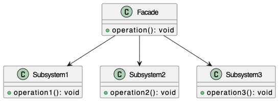

# Facade Pattern

**_Facade Pattern is a structural design pattern that provides a unified interface to a set of interfaces in a subsystem. Facade defines a higher level interface that makes the subsystem easier to use._**

## Description
The intent of the Facade pattern is to provide a simplified interface to a complex system of classes, libraries, or frameworks. It promotes loose coupling between clients and the subsystem by abstracting away the details of subsystem components behind a single interface.

## Key Characteristics
- **One-to-Many Relationship:** A Facade typically interacts with multiple subsystem classes, coordinating their behavior to fulfill client requests.
- **Simplified, Not Limited:** Even when the Facade provides a simplified way to interact with subsystems, that doesn't mean that for advanced uses the interaction with the subsystem itself is restricted. Other kinds of operations or more complex scenarios should be handled as well.
- **Decoupling Layer:** It creates a buffer (intermediary) between client code and subsystem implementation, making the system more maintainable and allowing subsystem internals to evolve without affecting clients. Changes in subsystems do not affect any other existing logic other than the Facade internals.

### Practical Indicators
Look for these patterns in your code:

- Client code that instantiates multiple related objects together
- Methods that always call the same sequence of operations across different classes
- Repeated initialization or configuration logic scattered throughout the codebase
- Comments explaining "how to use" multiple classes together
- High coupling between application layers

### Facade Rules
- If you are in a particular method in a particular object, you are only allowed to invoke some particular methods depending on where these methods reside.
- You are able to invoke the methods of the particular object that you are in.
- Objects that have been passed as parameters - their methods can be called.
- Invoke methods that you've created yourself. So all the objects (and their) methods created inside an allowed method can be invoked as well.
- Methods on a component of this object. All the classes instantiated within an allowed method can be invoked as well.

### Conditions to use Facade Pattern
- Simplify interaction with your subsystem for client classes (build interactive methods for the client).
- Need a class to act as an interface between your subsystem and the client class.

### Steps to implement the Facade
1. Design the interface 
2. Implement the interface with one or more classes
3. Create the Facade class and wrap the classes that implement the interface
4. Use the Facade class to access the subsystem

### Best Practices
- Prefer Object Composition by using Dependency Injection over Internal Instantiation.
- By the Single Responsibility Principle, create each Facade per one cohesive area of functionality.
- The subsystem components should be __private__ to the Facade. This reinforces that the Facade is the intended interface.
