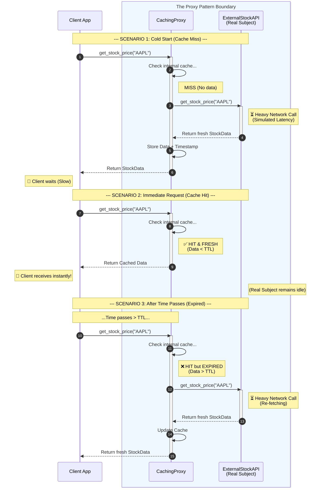

```mermaid blocks
sequenceDiagram
    autonumber
    participant Client as Client App
    participant Proxy as CachingProxy
    participant RealSubject as ExternalStockAPI<br/>(Real Subject)

    box rgb(240, 248, 255) The Proxy Pattern Boundary
        participant Proxy
        participant RealSubject
    end

    note over Client, RealSubject: --- SCENARIO 1: Cold Start (Cache Miss) ---
    Client->>Proxy: get_stock_price("AAPL")
    activate Proxy
    
    Proxy->>Proxy: Check internal cache...
    Note right of Proxy: MISS (No data)
    
    Proxy->>RealSubject: get_stock_price("AAPL")
    activate RealSubject
    Note right of RealSubject: ⏳ Heavy Network Call<br/>(Simulated Latency)
    RealSubject-->>Proxy: Return fresh StockData
    deactivate RealSubject
    
    Proxy->>Proxy: Store Data + Timestamp
    Proxy-->>Client: Return StockData
    deactivate Proxy
    Note left of Client: 🐢 Client waits (Slow)

    note over Client, RealSubject: --- SCENARIO 2: Immediate Request (Cache Hit) ---
    Client->>Proxy: get_stock_price("AAPL")
    activate Proxy
    
    Proxy->>Proxy: Check internal cache...
    Note right of Proxy: ✅ HIT & FRESH<br/>(Data < TTL)
    
    Proxy-->>Client: Return Cached Data
    deactivate Proxy
    Note left of Client: 🐇 Client receives instantly!
    Note right of RealSubject: (Real Subject remains idle)

    note over Client, RealSubject: --- SCENARIO 3: After Time Passes (Expired) ---
    Note over Client, Proxy: ...Time passes > TTL...
    Client->>Proxy: get_stock_price("AAPL")
    activate Proxy
    
    Proxy->>Proxy: Check internal cache...
    Note right of Proxy: ❌ HIT but EXPIRED<br/>(Data > TTL)
    
    Proxy->>RealSubject: get_stock_price("AAPL")
    activate RealSubject
    Note right of RealSubject: ⏳ Heavy Network Call<br/>(Re-fetching)
    RealSubject-->>Proxy: Return fresh StockData
    deactivate RealSubject
    
    Proxy->>Proxy: Update Cache
    Proxy-->>Client: Return fresh StockData
    deactivate Proxy
```